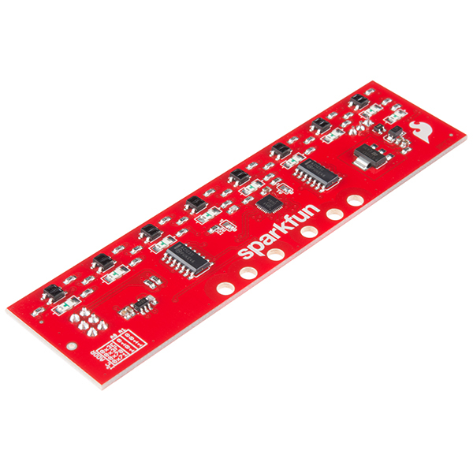

# Line follower
The line follower functionality enables the robot to autonomously navigate along predefined paths by detecting and following lines on the ground. Using a specialized line following sensor, the robot continuously scans the surface for contrasting colors or reflective markers that define the desired path. Real-time adjustments in the robot's movements are made based on the sensor's feedback, ensuring precise tracking and adherence to the designated route.

## Hardware
[Sparkfun Line follower sensor array][1] is used for this functionality.

<center></center>

The sensor incorporates eight diodes for line detection, with each diode's illumination indicating the presence of a line beneath it. Additionally, a calibration knob enables users to adjust detection sensitivity, accommodating variations in substrate and line color shades. More information is available [here][2].

For sensor communication, SPI technology is utilized, which relies on two data pins and a clock (more information [here][3]). To power the sensor, a voltage of around 5V is required.

In the described robot, the following pins are utilized:
- Data **PB_9**
- Clock **PB_8**

**NOTE:** [Nucleo-F446RE pinmap][4] 

## Software
The following is a description of the software used to perform the task in the form of line tracking. 
### Main
The algorithm calculating the appropriate values of wheel speeds is built inside the driver, so from the main file it is necessary to define the appropriate variables and declare the appropriate objects. The software code must contain:
- DC motor object - manual for DC motors can be found here 
<!-- TODO add link -->
- Line follower object - manual for line follower driver can be [here](#line-follower-driver)

The line follower's ``main`` file can be found [here](../solutions/Line_follower_main.txt). The description below refers to this file and contains an explanation of how the algorithm inside is constructed.

#### State machine

1. Initial State (INITIAL):
- In this state, all systems are enabled, and the robot prepares for operation.
- If the robot is moving (determined by the condition `move == true`), it transitions to the FOLLOW state to start following the line.
- If the robot is not moving (determined by the condition `move == false`), it transitions to the SLEEP state to wait for a signal to start moving.

2. Follow State (FOLLOW):
- In this state, the robot actively follows the line using the line-following algorithm.
- The robot's motor speeds are adjusted based on the line-following algorithm's outputs.
- If the robot stops moving (determined by the condition `move == false`), it transitions to the SLEEP state to wait for a signal to start moving again.

3. Sleep State (SLEEP):
- In this state, the robot stops its motors and waits for a signal to start moving.
- If the robot detects movement (determined by the condition `move == true`), it transitions to the FOLLOW state to resume line-following.

#### Possible adjustments
The algorithm is programmed to have the robot move for a specific period after losing the line, and then stop. To achieve this, functionality has been implemented to determine the stopping time for the robot based on a predefined duration. The process unfolds as follows:

1. Time Definition: The parameter `stop_time` defines the duration (in seconds) for which the robot should move after losing the line before coming to a complete stop.

2. Conversion to Iterations: This time is converted into an equivalent number of iterations (`stop_time_iteration`) based on the main task period. For instance, if the main task period is 20 milliseconds and `stop_time` is set to 1 second, then `stop_time_iteration` would be calculated as 1000 ms / 20 ms = 50 iterations.

3. Counter Incrementation: Upon losing the line, a counter (`i`) is incremented. This counter keeps track of the number of iterations since the robot last detected the line.

4. Checking Counter Against Threshold: If the counter (`i`) exceeds the predetermined number of iterations (`stop_time_iteration`), it indicates that the specified time has elapsed since the robot lost the line.

5. Setting the `move` Variable: Once the counter exceeds `stop_time_iteration`, the `move` variable is set to `false`. This action causes the robot to stop moving entirely.

By adjusting the `stop_time` parameter, users can control the duration for which the robot continues to move after losing the line. Increasing `stop_time` extends the movement duration, while decreasing it shortens the interval before the robot comes to a stop.

### Line follower driver
Line follower driver is used to calculate wheel speed based on sensor indications and robot geometry, as well as other settings declared by the user.

#### Constructor
When declaring a function, the following variables must be defined (in **SI** units if applicable):
- SDA pin - used for data transfer in SPI standard
- SCL pin - used for clock synchronization
- bar_dist - distance of diodes from wheel axes
- d_wheel - wheel diameter
- L_wheel - wheelbase
- max_motor_vel_rps - maximum engine speed given in revolutions per second

The remaining values are defined by default, but there is a possibility to change some of the parameters, as described below the description of the internal algorithm operation

**NOTE:** The velocity values provided as input are originally expressed in revolutions per second. However, within the driver, these values are converted into radians per second for calculation purposes. Once the calculation is completed in this unit, it is then converted back into revolutions per second. This conversion allows for the use of a unit directly compatible with the DC motor object.

#### Thread algorithm description
The `followLine` function is a thread task method responsible for controlling the robot to follow a line based on sensor readings.

1. Thread Execution: The `followLine` method runs continuously in a thread loop. It waits for a thread flag to be set before executing, indicating that it should perform its task.

2. Sensor Reading: Inside the loop, the method checks if any LEDs on the sensor bar are active. If any LEDs are active, it calculates the average angle of the detected line segments relative to the robot's orientation. This angle is stored in `m_sensor_bar_avgAngleRad`.

3. Control Calculation:
- The maximum wheel velocity in radians per second (`m_max_wheel_vel_rads`) is calculated based on the maximum wheel velocity (`m_max_wheel_vel`).
- The rotational velocity (`m_robot_coord(1)`) is determined using a control function `ang_cntrl_fcn`, which adjusts the robot's orientation to align with the detected line.
- The translational velocity (`m_robot_coord(0)`) is determined using another control function `vel_cntrl_v2_fcn`, which calculates the robot's forward velocity based on the rotational velocity and geometric parameters.
- The robot's wheel speeds are calculated using the inverse transformation matrix `m_Cwheel2robot`.

4. Wheel Velocity Conversion: The calculated wheel speeds are converted from radians per second to revolutions per second (`m_right_wheel_velocity` and `m_left_wheel_velocity`).

5. Thread Flag Signaling: After completing its task, the method waits for the next iteration by waiting for the thread flag to be set again.

#### Angular velocity controller
The `ang_cntrl_fcn` function is responsible for calculating the angular velocity of the robot based on the detected angle of the line relative to the robot's orientation. This function uses proportional and non-linear control to calculate the velocity based on mentioned angle.

1. Input Parameters:
- `Kp`: Proportional gain parameter for angular control.
- `Kp_nl`: Non-linear gain parameter for angular control.
- `angle`: The angle of the detected line relative to the robot's orientation.

2. Calculation:
- If the angle is positive (`angle > 0`), the function calculates the angular velocity (`retval`) using the formula:
    ```
    retval = Kp * angle + Kp_nl * angle * angle
    ```
    This formula applies proportional control (`Kp * angle`) along with a non-linear correction term (`Kp_nl * angle * angle`).
- If the angle is zero or negative (`angle <= 0`), the function calculates the angular velocity (`retval`) using a similar formula but with a negative sign for the non-linear term:
    ```
    retval = Kp * angle - Kp_nl * angle * angle
    ```
3. Output:
- The function returns the calculated angular velocity (`retval`).

#### Linear velocity controller
The `vel_cntrl_v2_fcn` function calculates the linear velocity of the robot based on its angular velocity and geometric parameters. The function ensures that one of the robot's wheels always turns at maximum velocity while the other adjusts its speed to maintain the desired angular velocity.

1. Input Parameters:
- `wheel_speed_max`: Maximum wheel speed in radians per second.
- `b`: Geometric parameter related to the distance between the wheels .
- `robot_omega`: Angular velocity of the robot.
- `Cwheel2robot`: Transformation matrix from wheel to robot coordinates.

2. Calculation:
- If `robot_omega` is positive, it assigns the maximum wheel speed to the first wheel and calculates the speed for the second wheel by subtracting `2 * b * robot_omega` from the maximum speed.
- If `robot_omega` is negative or zero, it assigns the maximum wheel speed to the second wheel and calculates the speed for the first wheel by adding `2 * b * robot_omega` to the maximum speed.
- The function then calculates the robot's coordinate velocities by multiplying the transformation matrix `Cwheel2robot` by the wheel speeds.
- Finally, it returns the linear velocity of the robot, which corresponds to the velocity along the x-axis in the robot's coordinate system.

3. Output:
- The function returns the calculated linear velocity of the robot.

#### Parametres adjustment
The LineFollower class provides functionality to dynamically adjust key parameters:

1. Proportional Gain (Kp) and Non-linear Gain (Kp_nl):
- Function: `void setRotationalVelocityGain(float Kp, float Kp_nl)`
- Parameters: `Kp` and `Kp_nl`
- Description: These parameters influence the proportional and non-linear correction in the robot's angular velocity control, allowing users to fine-tune the response to deviations from the desired line angle.

2. Maximum Wheel Velocity:
- Function: `void setMaxWheelVelocity(float max_wheel_vel)`
- Parameter: `max_wheel_vel`
- Description: This parameter limits the maximum wheel velocity (argument in rotations per second), indirectly affecting the robot's linear and angular velocities. Users can adjust this limit to optimize performance based on environmental conditions and specific requirements.


<!-- Links: -->
[1]: https://www.sparkfun.com/products/13582
[2]: https://learn.sparkfun.com/tutorials/sparkfun-line-follower-array-hookup-guide
[3]: https://learn.sparkfun.com/tutorials/serial-peripheral-interface-spi/all
[4]: https://os.mbed.com/platforms/ST-Nucleo-F446RE/